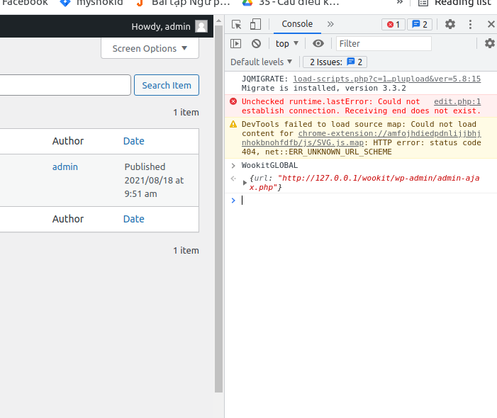
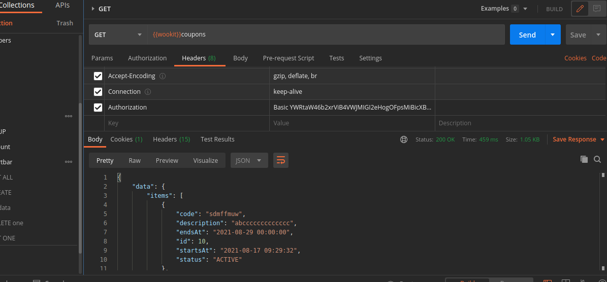

# Auth ajax

## 1.Get auth

### Method:POST

### URL: lấy biến global WookitGLOBAL.url 


chú ý: login với quyền admin,khi lấy dc code thì phải nốt code với 
"Basic "+code
ví dụ:


````ts
export interface Auth {
    data: Data
    /** messege là tin nhắn trả lại trên sever*/
    message: string
    status: (success | error)
}

export interface Data {
    /** code xác thực admin*/
    code: string
}
````